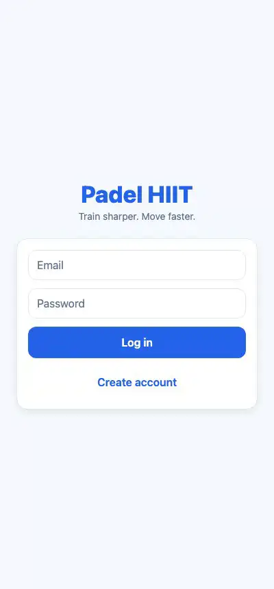

# Padel HIIT

An interval-workout app for padel and tennis players. Build a HIIT workout, run it with a timer and audio cues, and drill your reactions: while the clock runs, the app calls out a shot at random and speaks it aloud so you react without looking at the screen. One Expo codebase runs it on the web, iOS, and Android.

Live: https://padel-app-hiit.vercel.app

<p align="center">
  
</p>

## How it works

You build a workout from a library of exercises, setting the work time, rest, rounds, and sets for each. Running it hands the definition to a workout engine that flattens it into a plain list of timed steps, expanding the rounds and sets and dropping the trailing rest after the last one. The player renders whatever the engine emits: a large countdown, the current exercise, an animation, and an "up next" preview during rest. Beeps and spoken cues carry the workout when the phone is across the room.

## Reaction exercises

This is the part built for court work. A reaction exercise carries a pool of shots, for example forehand and backhand. While the work timer runs, a sub-timer fires at a random interval you set per block (say every 2 to 5 seconds), picks a shot from the pool, speaks it through text-to-speech, and flashes the direction on a small court graphic. You keep moving and respond to the call, the same way a coach feeds you at the net.

The call-out audio is pluggable. Device text-to-speech is the default, and if a shot has a recorded clip that plays instead, so voice files can be dropped in later without touching the code.

## History

Every completed run is saved as an immutable snapshot of the workout as it was run, not a link to the workout. Editing or deleting a workout never rewrites your past sessions, and "repeat" rebuilds the run from the snapshot.

## Stack

- Expo (React Native) with React Native Web, so one codebase targets web, iOS, and Android
- Supabase for auth, Postgres, storage, and an edge function that caches exercise metadata
- expo-speech for the spoken call-outs, expo-audio for the beeps
- TypeScript throughout
- Jest for the tests (the workout engine and reaction driver are pure logic and covered directly)

## Running locally

You need a Supabase project. Copy the example env and fill in the URL and anon key:

```bash
cp .env.example .env.local
```

Bring the schema up with the migrations in `supabase/`, then start the app:

```bash
npm install
npm run web
```

The engine, reaction driver, and screens run without a backend in the test suite:

```bash
npm test
```
